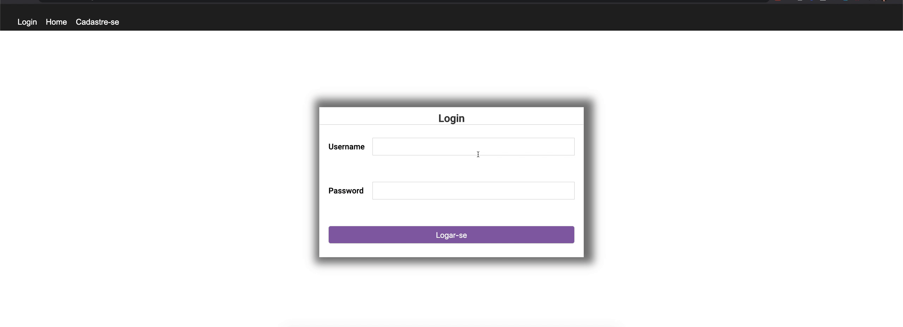

<h1>
    
</h1>

<p align="center">🎉
  <a href="#-sobre"> Sobre </a>&nbsp;&nbsp;&nbsp;|&nbsp;&nbsp;&nbsp;
  <a href="#-conceitos-ensinados">Conceitos ensinados</a>&nbsp;&nbsp;&nbsp;|&nbsp;&nbsp;&nbsp;
  <a href="#-material-de-apoio">Material de apoio</a>&nbsp;&nbsp;&nbsp;|&nbsp;&nbsp;&nbsp;
    <a href="#-como-baixar">Como baixar</a>
</p>

# 🔖 Sobre

Esse projeto foi criado como parte do desenvolvimento de um tutorial "Total Zero", ensinando como desenvolver uma aplicação no Frontend e Backend.

## ✍🏻 Conceitos ensinados

Durante o desenvolvimento, foi ensinado conceitos como Hooks, dentro do ReactJS, como criar um componente, estilização utilizando conceitos do CSS entre outros.

## 🗂 Material de apoio

- [Create React App](https://github.com/facebook/create-react-app)
- [ReactJS](https://pt-br.reactjs.org/)
- [React Router DOM](https://reacttraining.com/react-router/web/api/Hooks/usehistory)
- [FlexBox](https://origamid.com/projetos/flexbox-guia-completo/)
- [Fontes Google](https://fonts.google.com/)
- [Conceitos de Table Html](https://www.w3schools.com/tags/tag_th.asp)

## ⬇️ Como baixar

```bash

    // Clonar repositório
    $ git clone https://github.com/danileao/total-zero-frontend

    // Acessar diretório
    $ cd total-zero-frontend

    // Instalar dependências
    $ yarn

    // Iniciar projeto
    $ yarn start
```

---

<h3 align="center">Desenvolvido por  💜  Daniele Leão Evangelista </h3>
